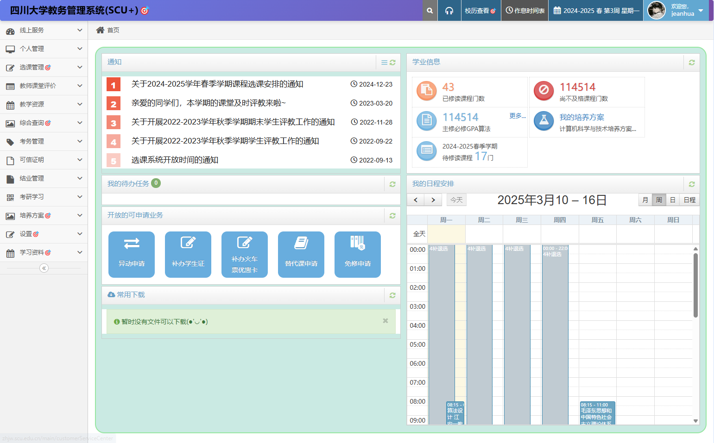
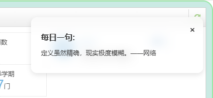
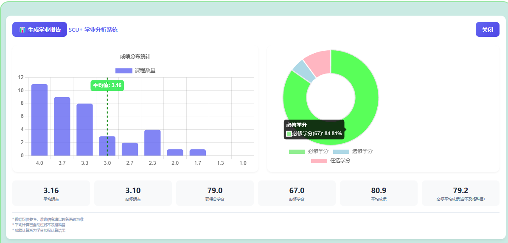
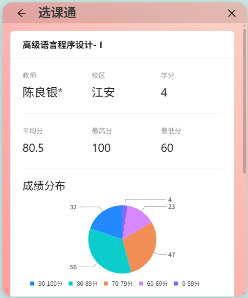
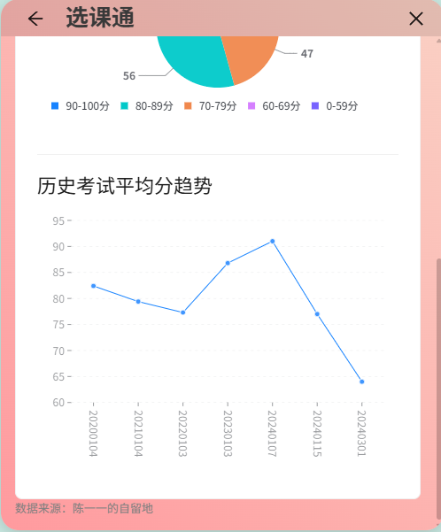

# SCU+ 🎯 —— 四川大学教务系统增强插件

  
  
  

 

> 🌈 为四川大学教务系统量身打造的浏览器插件，兼具高颜值设计与实用功能增强

快速访问: &emsp; [如何安装](#浏览器扩展安装) &emsp; [常见问题解答](#-常见问题解答) &emsp; [维基页面](https://github.com/The-Brotherhood-of-SCU/scu-plus/wiki)

## 🖼 功能预览

### 界面美化组
主页焕新：

隐私保护：

每日箴言：

### 数据分析组
成绩分析：

课程统计：

### 功能细节组
| 功能 | 预览 |
| --- | --- |
| 挂科过滤 |  |
| GPA/挂科数定制 |  |

### 选课通
| 基础信息 | 历史记录 |
| --- | --- |
|  |  |

## ✨ 核心功能

### 🛡️ 隐私与安全
- **智能隐私保护**   自动隐藏姓名、学号及证件照，支持一键切换模式
- **登录简化**    OCR验证码识别 + 统一认证重定向登录
- **退课提醒**   退课时，显示退课课程名，避免误退课

### 📊 学业数据可视化
| 模块         | 功能亮点                            |
|--------------|-------------------------------------|
| **成绩看板** | GPA自动计算 / 挂科过滤 / 自定义统计维度 |
| **课程统计** | 课时总量分析 / 学分进度追踪          |
| **数据导出** | 一键生成课表图片 / 成绩单备份        |

### 🚀 效率增强
- ✔️ 培养方案直达入口
- ✔️ 校历显示错误修复
- ✔️ 隐藏成绩提前获取
- ✔️ 通知栏异常修复

### 🌈 界面优化
- **现代风格界面**  
  重设计教务系统主界面与功能页面
- **个性化设置**
- **每日箴言**  
  在登录页展示哲理语句与诗词精选

## 🛠️ 快速安装

### 浏览器扩展安装

| 步骤 | 操作说明 |
|------|----------|
| 1. **下载** | [点击下载](https://github.com/The-Brotherhood-of-SCU/scu-plus/releases)压缩包 (chrome-mv3-prod.zip) |
| 2. **访问浏览器扩展页面** | `chrome://extensions` |
| 3. **启用开发者模式** | `开发者模式`开关 → 切换至开启状态 → 刷新页面 |
| 4. **加载插件** | 把ZIP包拖入扩展页面 → 确认安装 |

**Note**：仅支持Chromium系浏览器（Chrome、Edge等），暂不支持FireFox

如果您仍然不清楚，可以参考 [小白教程](https://github.com/The-Brotherhood-of-SCU/scu-plus/wiki/%E5%AE%89%E8%A3%85)

## 🌟 高阶功能

| 功能           | 使用场景           | 操作指引               |
|----------------|--------------------|------------------------|
| 配置同步       | 多设备切换使用     | 设置页 → 导入/导出配置 |
| 自动OCR服务 | 自动识别并填充验证码 | 设置页 → 输入OCR服务提供者 （详情如下） |

### OCR服务配置（可选）
如果要部署ocr服务，请参考[相关维基](https://github.com/The-Brotherhood-of-SCU/scu-plus/wiki/%E8%AE%BE%E7%BD%AE#ocr-%E9%85%8D%E7%BD%AE)

## 🤝 参与贡献

我们欢迎任何形式的贡献！您可以通过以下方式参与：
1. 提交功能建议 → [新建Issue](https://github.com/The-Brotherhood-of-SCU/scu-plus/issues)

2. 开发新功能 → 参考 [贡献手册](https://github.com/The-Brotherhood-of-SCU/scu-plus/wiki/%E8%B4%A1%E7%8C%AE)

3. 文档改进 → 直接编辑README.md文件

## 📌 常见问题解答

**Q：为什么需要OCR服务？**  
A：用于自动识别统一认证登录的验证码，服务端代码已包含在`ocr_server`目录。

**Q：插件数据会上传服务器吗？**  
A：所有数据处理均在本地完成，不存在数据上传行为（除了OCR服务）。

**Q：浏览器显示'关闭开发人员模式下的扩展'弹窗，如何禁用弹窗？**  
A：参考该专栏更改配置文件：https://www.bilibili.com/opus/1003408122502447108

## 📜 开源协议

本项目基于 **[GPL-3.0 License](./LICENSE)** 开源，任何二次开发请保持开源且注明原始出处。

## 🌟 Star History

