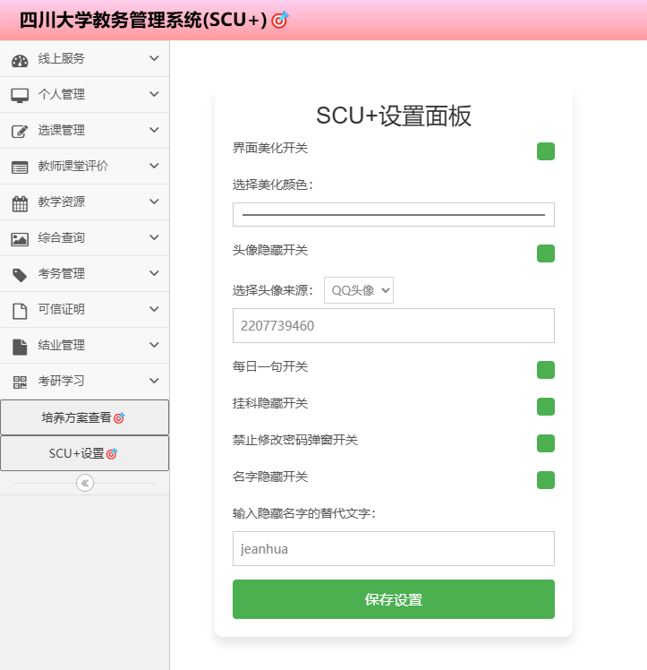

# SCU+🎯

## 四川大学教务系统美化拓展插件

插件功能：

1. 主页美化

   

2. 在方案成绩页面添加平均成绩、绩点、学分等计算功能

   

3. 在主页隐藏姓名和丑陋的学生证照片

   

4. 隐藏暂未及格科目数

   

5. 在本学期课表和选课结果页面添加统计

   

6. 添加培养方案查看入口

   

7. 每日一言

   

8. 修复了教务系统的一些bug问题，比如查看通知的遮罩问题和搜索结果少导致窗口高度不够的问题……

   

9. 四川大学统一身份认证自动验证码OCR
    
    需要在插件设置中设置API地址，API服务器需要自己部署。
    
    服务器代码位于`./ocr_server`目录下，服务器的OCR API地址为`/ocr`，例如`https://example.com/ocr`

### 使用方法

1. 先在浏览器中启用`开发者人员模式`
2. 下载zip压缩包，在浏览器插件拓展页面，将zip包拖入，即可安装
