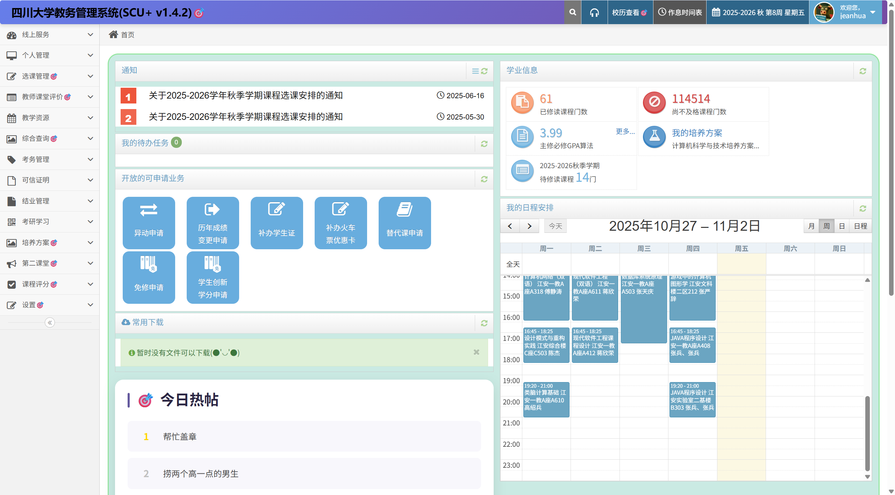
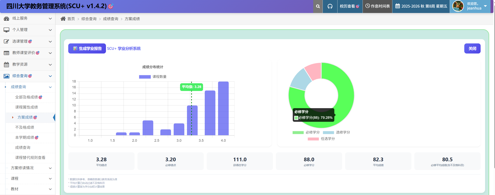

# 🎯 SCU+ —— 四川大学教务系统增强插件

> 🌈 **为四川大学教务系统量身打造的浏览器增强插件，兼具高颜值设计与实用功能**

📎 快速导航：
 [🧩 安装指南](#%EF%B8%8F-安装指南) · [💡 常见问题](#-常见问题解答faq) · [📖 维基页面](https://github.com/The-Brotherhood-of-SCU/scu-plus/wiki)

------

## 🖼 功能预览

### 🎨 界面美化组

| 模块             | 预览图                             |
| ---------------- | ---------------------------------- |
| **主页焕新**     |  |

------

### 📊 数据分析组

| 模块         | 预览图                          |
| ------------ | ------------------------------- |
| **成绩分析** |  |

------

### ⚙️ 功能细节组

| 功能             | 预览                                |
| ---------------- | ----------------------------------- |
| 挂科隐藏         |  |
| GPA / 挂科数定制 |   |

------

### 📚 选课通

| 基础信息                              | 历史记录                              |
| ------------------------------------- | ------------------------------------- |
|  |  |

------

## ✨ 核心功能亮点

### 🛡️ 隐私与安全

- 🔒 **智能隐私保护**：自动隐藏姓名、学号、证件照，一键切换模式
- 🔑 **登录简化**：OCR 验证码识别 + 统一认证重定向登录
- ⚠️ **退课提醒**：退课前展示课程名称，避免误操作

### 📈 学业数据可视化

| 模块         | 功能亮点                                 |
| ------------ | ---------------------------------------- |
| **成绩看板** | GPA 自动计算 / 挂科过滤 / 自定义统计维度 |
| **课程统计** | 课时总量分析 / 学分进度追踪              |
| **数据导出** | 一键生成课表图片 / 成绩单备份            |

### ⚡ 效率增强

- 🚀 培养方案直达入口
- 📅 修复校历显示错误
- ⏱️ 隐藏成绩提前获取
- 🧭 通知栏异常修复
- ✔️ 一键教学评估
- 🎯 自定义选课筛选器

### 🌈 界面优化

- 🧩 **现代化UI**：重设计教务系统主界面
- 🎨 **个性化设置**：主题、布局随心调
- 📜 **每日箴言**：登录页诗词佳句，提升体验

------

## 🛠️ 安装指南

### 🔧 浏览器扩展安装步骤

| 步骤                 | 操作说明                                                     |
| -------------------- | ------------------------------------------------------------ |
| 1️⃣ **下载插件**       | [点击下载](https://github.com/The-Brotherhood-of-SCU/scu-plus/releases) 压缩包（chrome-mv3-prod.zip） |
| 2️⃣ **访问扩展页面**   | 在地址栏输入 `chrome://extensions`                           |
| 3️⃣ **启用开发者模式** | 打开右上角 `开发者模式` 开关，刷新页面                       |
| 4️⃣ **加载插件**       | 将下载的 ZIP 包拖入扩展页面，确认安装                        |

💡 **提示**：仅支持 Chromium 系浏览器（Chrome、Edge等），暂不支持 Firefox、Safari。  
 📘 详细图文版请参考 [小白安装教程](https://github.com/The-Brotherhood-of-SCU/scu-plus/wiki/安装)。

------

## 🌟 辅助功能

| 功能          | 使用场景       | 操作说明                                 |
| ------------- | -------------- | ---------------------------------------- |
| 配置同步      | 多设备切换使用 | 设置页 → 导入 / 导出配置                 |
| 自动 OCR 服务 | 自动识别验证码 | 设置页 → 输入 OCR 服务提供者（详见下方） |

### 🔍 OCR 服务配置（可选）

若需自行部署 OCR 服务，请参考  
 👉 [OCR 配置维基文档](https://github.com/The-Brotherhood-of-SCU/scu-plus/wiki/设置#ocr-配置)

------

## 🤝 贡献指南

💬 我们欢迎任何形式的贡献！

| 类型         | 操作                                                         |
| ------------ | ------------------------------------------------------------ |
| 💡 功能建议   | [创建 Issue](https://github.com/The-Brotherhood-of-SCU/scu-plus/issues) |
| 🧩 新功能开发 | 参考 [贡献手册](https://github.com/The-Brotherhood-of-SCU/scu-plus/wiki/贡献) |
| 📝 文档改进   | 直接编辑 `README.md`                                         |

------

## 📌 常见问题解答（FAQ）

**Q1：为什么需要 OCR 服务？**  
 A：用于自动识别统一认证登录验证码。服务端代码位于 [scu-plus-ocr](https://github.com/The-Brotherhood-of-SCU/scu-plus-ocr) 仓库。

**Q2：插件会上传个人数据吗？**  
 A：不会。除 OCR 服务外，所有数据处理均在本地完成。

**Q3：如何解决“关闭开发者模式扩展”弹窗？**  
 A：可使用 [remove-edge-extension-notice](https://github.com/The-Brotherhood-of-SCU/remove-edge-extension-notice)，  
 或参考此教程：[Bilibili专栏链接](https://www.bilibili.com/opus/1003408122502447108)

------

## 📜 开源协议

本项目基于 **[GPL-3.0 License](./LICENSE)** 开源。  
请在二次开发中保持开源并注明原始出处。

------

## 💖 致谢与贡献者

感谢所有为 **SCU+** 做出贡献的开发者与社区成员！

    
 
   由 <a href="https://github.com/The-Brotherhood-of-SCU">The Brotherhood of SCU</a> ❤️ 倾情打造 

---

## ⭐ Star History

