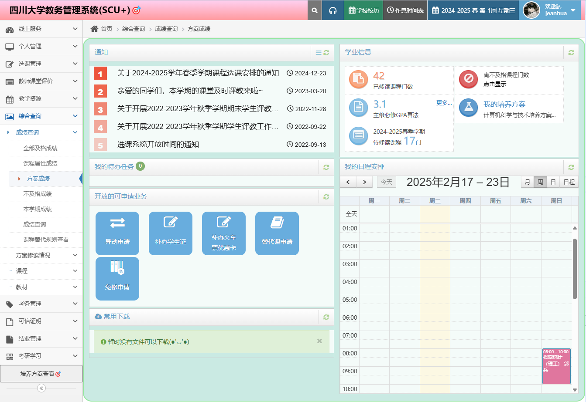
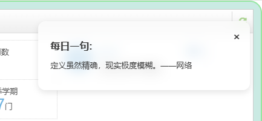

# SCU+ 🎯 —— 四川大学教务系统增强插件

[](https://github.com/your-repo/scu-plus/blob/main/LICENSE) 
[](https://github.com/your-repo/scu-plus/pulls) 
[](https://github.dev/your-repo/scu-plus)

> 🌈 为四川大学教务系统量身打造的浏览器插件，兼具高颜值设计与实用功能增强

---

<details>
<summary>📸 点击展开功能截图</summary>

### 🖼 界面美化组
| 主页焕新                        | 隐私保护                        | 每日箴言                        |
| ------------------------------- | ------------------------------- | ------------------------------- |
|  |  |  |

### 📊 数据分析组
| 成绩分析                        | 课程统计                        |
| ------------------------------- | ------------------------------- |
|  |  |

### ⚙️ 功能细节组
| 挂科过滤                        | GPA/挂科数定制                 |
| ------------------------------- | ------------------------------ |
|  |  |

</details>


---

## ✨ 核心功能

### 🛡️ 隐私与安全
- **智能隐私保护**  
  自动隐藏姓名、学号及证件照，支持一键切换模式
- **登录简化**  
  OCR验证码识别 + 统一认证重定向登录
- **退课提醒**
  退课时，显示退课课程名，避免误退课

### 📊 学业数据可视化
| 模块         | 功能亮点                            |
| ------------ | ----------------------------------- |
| **成绩看板** | GPA自动计算/挂科过滤/自定义统计维度 |
| **课程统计** | 课时总量分析/学分进度追踪           |
| **数据导出** | 一键生成课表图片/成绩单备份         |

### 🚀 效率增强
```markdown
- ✔️ 培养方案直达入口
- ✔️ 校历显示错误修复
- ✔️ 隐藏成绩提前获取
- ✔️ 通知栏异常修复
```

### 🌈 界面优化
- **现代风格界面**  
  重设计教务系统主界面与功能页面
- **个性化设置**  
- **每日箴言**  
  在登录页展示哲理语句与诗词精选

---

## 🛠️ 快速安装

### 浏览器扩展安装
1. [点击下载](https://cnb.cool/The-Brotherhood-of-SCU/scu-plus/-/releases)压缩包 (chrome-mv3-prod.zip)
2. 访问扩展页面  
   `chrome://extensions` 或 `edge://extensions`
3. 启用开发者模式  
   <kbd>开发者模式开关</kbd> → 切换至开启状态
4. 加载插件文件  
   解压ZIP包 → 把文件夹拖入扩展页面 → 确认安装

### OCR服务配置（可选）
```bash
# 启动OCR服务（需Python环境）
cd ./ocr_server
python server.py
```
1. 进入插件设置 → 网络设置
2. 输入API地址：`http://localhost:[port]/ocr`
3. 测试连接 → 保存配置

---

## 🌟 高阶功能

| 功能           | 使用场景           | 操作指引               |
| -------------- | ------------------ | ---------------------- |
| 配置同步       | 多设备切换使用     | 设置页 → 导入/导出配置 |
| 学期数据预加载 | 快速查看未开放成绩 | 成绩页 → 自动加载成绩  |
| 教学日历修复   | 查看完整校历信息   | 校历页 → 自动加载补丁  |

---

## 🤝 参与贡献

我们欢迎任何形式的贡献！您可以通过以下方式参与：
1. 提交功能建议 → [新建Issue](https://cnb.cool/The-Brotherhood-of-SCU/scu-plus/-/issues)
2. 开发新功能 → Fork项目后提交Pull Request
3. 文档改进 → 直接编辑README.md文件

---

## 📜 开源协议

本项目基于 **[GPL-3.0 License](./LICENSE)** 开源，任何二次开发请保持开源且注明原始出处。

---

<details>
<summary>📌 常见问题解答</summary>

**Q：为什么需要OCR服务？**  

- A：用于自动识别统一认证登录的验证码，服务端代码已包含在`ocr_server`目录

**Q：插件数据会上传服务器吗？**  

- A：所有数据处理均在本地完成，不存在数据上传行为

**Q：如何彻底卸载插件？**  

- A：浏览器扩展页面 → 移除插件 → 清除缓存数据

</details>
