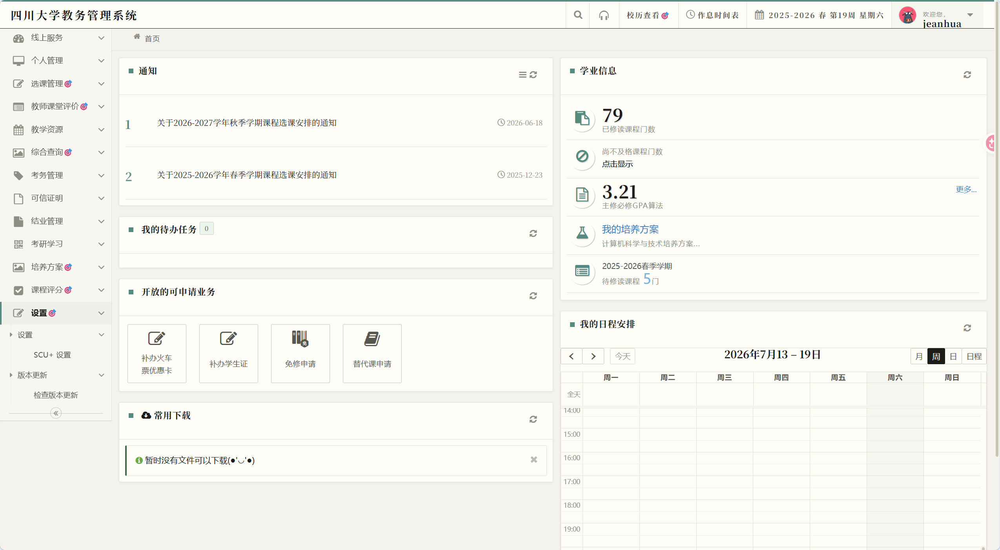
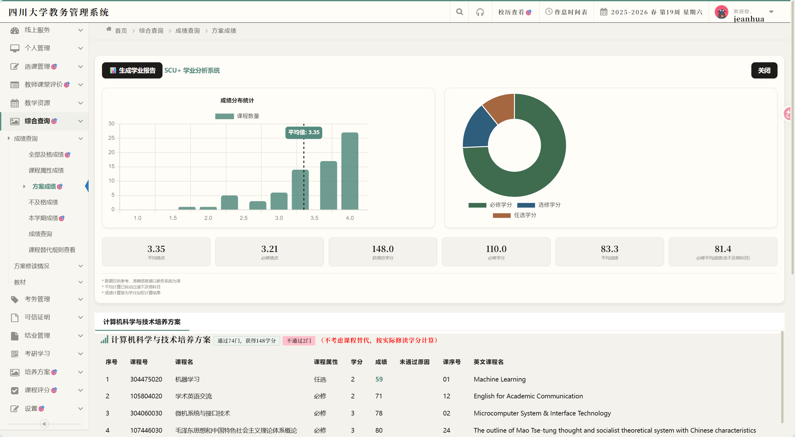

# 🎯 SCU+

**四川大学教务系统增强插件**

高颜值设计 × 实用功能，让你的教务系统焕然一新

[🧩 安装指南](#-安装指南) · [✨ 功能亮点](#-核心功能) · [💡 常见问题](#-常见问题faq) · [📖 Wiki](https://github.com/The-Brotherhood-of-SCU/scu-plus/wiki)

---

## 🖼 界面预览

全新杂志风主题，教务系统也能优雅

## ✨ 核心功能

### 🛡️ 隐私与安全

- 🔒 **智能隐私保护** — 自动隐藏姓名、学号、证件照，一键切换
- 🔑 **登录简化** — OCR 验证码识别 + 统一认证重定向登录
- ⚠️ **退课提醒** — 退课前展示课程名称，避免误操作

### 📈 学业数据可视化

| 模块 | 功能亮点 |
| --- | --- |
| **成绩看板** | GPA 自动计算 / 挂科过滤 / 自定义统计维度 |
| **课程统计** | 课时总量分析 / 学分进度追踪 |
| **数据导出** | 一键生成课表图片 / 成绩单备份 |

### ⚡ 效率增强

- 📅 修复校历显示错误
- ⏱️ 隐藏成绩提前获取
- 🧭 通知栏异常修复
- ✔️ 一键教学评估
- 🎯 自定义选课筛选器

### 🌈 界面优化

- 🧩 **杂志风主题** — 全新设计的现代化教务系统界面
- 🎨 **个性化设置** — 主题配色、布局随心调整

---

## 🛠️ 安装指南

| 步骤 | 操作说明 |
| --- | --- |
| 1️⃣ **下载插件** | [前往 Releases](https://github.com/The-Brotherhood-of-SCU/scu-plus/releases) 下载 `chrome-mv3-prod.zip` |
| 2️⃣ **访问扩展页面** | 地址栏输入 `chrome://extensions` |
| 3️⃣ **启用开发者模式** | 打开右上角「开发者模式」开关，刷新页面 |
| 4️⃣ **加载插件** | 将下载的 ZIP 包拖入扩展页面，确认安装 |

> 💡 **提示**：仅支持 Chromium 系浏览器（Chrome、Edge 等），暂不支持 Firefox、Safari。
> 📘 详细图文版请参考 [小白安装教程](https://github.com/The-Brotherhood-of-SCU/scu-plus/wiki/安装)。

---

## 🌟 辅助功能

| 功能 | 使用场景 | 操作说明 |
| --- | --- | --- |
| 配置同步 | 多设备切换使用 | 设置页 → 导入 / 导出配置 |
| 自动 OCR 服务 | 自动识别验证码 | 设置页 → 输入 OCR 服务提供者 |

🔍 <b>自行部署 OCR 服务（可选）</b>

若需自行部署 OCR 服务，请参考 👉 [OCR 配置维基文档](https://github.com/The-Brotherhood-of-SCU/scu-plus/wiki/设置#ocr-配置)

---

## 💡 常见问题（FAQ）

<b>Q1：为什么需要 OCR 服务？</b>

用于自动识别统一认证登录验证码。服务端代码位于 [scu-plus-ocr](https://github.com/The-Brotherhood-of-SCU/scu-plus-ocr) 仓库。

<b>Q2：插件会上传个人数据吗？</b>

不会。除 OCR 服务外，所有数据处理均在本地完成。

<b>Q3：如何解决「关闭开发者模式扩展」弹窗？</b>

可使用 [remove-edge-extension-notice](https://github.com/The-Brotherhood-of-SCU/remove-edge-extension-notice)，或参考此教程：[Bilibili 专栏](https://www.bilibili.com/opus/1003408122502447108)

---

## 🤝 贡献指南

💬 我们欢迎任何形式的贡献！

| 类型 | 操作 |
| --- | --- |
| 💡 功能建议 | [创建 Issue](https://github.com/The-Brotherhood-of-SCU/scu-plus/issues) |
| 🧩 新功能开发 | 参考 [贡献手册](https://github.com/The-Brotherhood-of-SCU/scu-plus/wiki/贡献) |
| 📝 文档改进 | 直接编辑 `README.md` |

---

## 📜 开源协议

本项目基于 **[GPL-3.0 License](./LICENSE)** 开源，请在二次开发中保持开源并注明原始出处。

---

### 💖 致谢

感谢所有为 **SCU+** 做出贡献的开发者与社区成员！

由 <a href="https://github.com/The-Brotherhood-of-SCU">The Brotherhood of SCU</a> ❤️ 倾情打造

