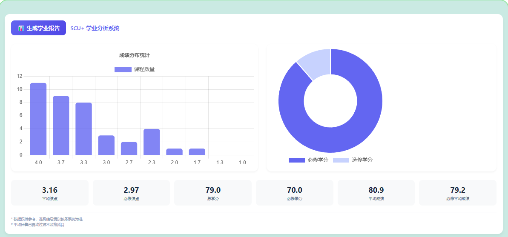

# SCU+ 🎯 —— 四川大学教务系统增强插件

 

> 🌈 一款为四川大学教务系统量身打造的颜值与实用兼具的浏览器插件

---

## ✨ 功能特性

### 🎨 视觉优化
• **焕新主页设计**  
• **隐私保护模式**  
  智能隐藏姓名与学生证照片  
  

• **通知栏缺陷修复**  
  解决遮罩层异常、搜索结果页高度错误等系统问题  

### 📊 数据增强
• **学业数据看板**  
  自动计算平均成绩、GPA、总学分等核心指标  
  

• **课程统计模块**  
  实时显示本学期课时总量与选课学分汇总  
  

• **成绩过滤系统**  
  智能隐藏未及格科目提示  
  


### 🚀 效率工具
• **培养方案直通车**  
  一键跳转培养方案查询页面  

• **AI验证码识别**  
  基于OCR技术实现统一认证自动登录  

  ```python
  # OCR服务部署示例
  # 详见 ./ocr_server 目录
  API_ENDPOINT = "https://your-domain.com/ocr"
  ```

### 🌟 人文关怀
• **每日箴言**  
  在教务系统内展示精选的好句  
  

---

## 📸 截图预览

| 功能展示 | 界面效果 |
|---------|----------|
| 课表统计 |  |
| 成绩分析 |  |
| 主页美化 |  |

---

## 🛠️ 安装指南

### 浏览器安装
1. 启用开发者模式：
   • Chrome: 访问 `chrome://extensions` → 开启「开发者模式」
   • Edge: 访问 `edge://extensions` → 开启「开发人员模式」
2. 拖拽安装：
   • 下载项目ZIP包 → 拖入浏览器扩展页面

### OCR服务配置
1. 部署OCR服务器（[服务器代码](./ocr_server)）
2. 插件设置 → 输入API端点地址（如 `https://your-api.com/ocr`）

---

## 🤝 参与贡献
欢迎通过 Issue 提交建议或 Fork 项目发起 Pull Request！

## 📜 开源协议
本项目基于 [GPL-3.0](./LICENSE) 开源。